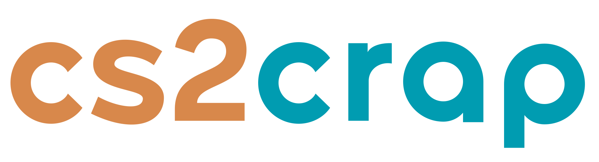
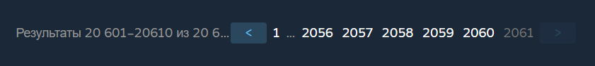
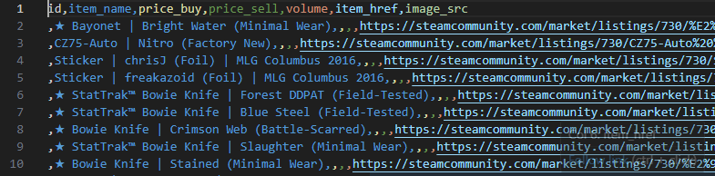
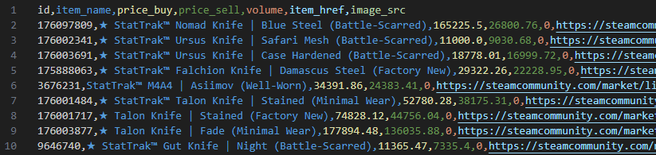

## **CS2CRAP - Инструментарий для парсинга, автоматизации поиска выгод и торговли предметами Counter Strike 2**



## 📄 **Описание**

**CS2CRAP - Набор инструментов для сбора и анализа актуальных данных с рынков и автоматизации торговли предметами из игры Counter Strike 2. На данный момент данные собираются из двух источников: [Steam Market](https://steamcommunity.com/market/) и [CS:GO Market](https://market.csgo.com/ru/).**

Этот инструментарий позволяет получить всю необходимую информацию о предметах Counter Strike 2, включая их ID, hash_name, ссылки на торговой площадке Steam, цены, количество продаж за последние сутки и ссылки на изображения предметов.

В репозитории также есть функции, позволяющие сортировать предметы (к примеру не учитывая граффити, стикеры и сувенирные скины), автоматически сравнивать цены на маркетах и присылать выгодные предметы с помощью вашего бота в Telegram.

### **Закрепим:**

-   Установили проект
-   Подключили телеграм-бота или запустили скрипт
-   Получили актуальную разницу цен
-   Закрыли сделку и получили профит


⚠️**WARNING: Не рекомендуется использование пакета steam_bot, так как он находится в разработке и был добавлен в целях изучения и возможной помощи в разработке.**

## 😎 **Отличие от схожих репозиториев**

### **1. Актуальность** 🔄

Все найденные мной репозитории на схожую тему были устаревшими, использовали не самые актуальные и выгодные методы сбора данных и не обладали таким разнообразным функционалом.

### **2. Прямой доступ к данным** 🔗

Данный репозиторий позволяет получать самые актуальные данные предметов на данный момент. Он не зависит от сторонних сервисов и сайтов потому что данные берутся напрямую из Steam.

### **3. Минимизация запросов** 📉

В этом репозитории используются методы вычисления для нахождения данных о продажах предмета [**volume**](#🕹️-steam), вместо отправки отдельного узкого запроса, ограничение на который составляет около 300-500 запросов в час.

### **4. Уже собранная база данных** 💾

На старте для сбора основных данных используя 5 прокси мне пришлось потратить около 9 часов работы программы для сбора данных всех предметов, выставленных на торговую площадку.

Вам не придётся. В папке /data вы можете найти уже рабочую базу со всеми предметами на торговой площадке.


## 🔍 **Собираемая информация:**

### 🕹️ **Steam**:

-   **id**: уникальный идентификатор предмета.
-   **item_name**: оригинальное название предмета.
-   **price_buy**: минимальный выставленный лот на продажу предмета.
-   **price_sell**: максимальный выставленный лот на покупку предмета.
-   **volume**: количество продаж предмета за последние 24 часа.
-   **item_href**: ссылка на предмет на торговой площадке.
-   **image_src**: ссылка на изображение предмета.

### 🛒 **CS:GO Market**:

-   **item_name**: название предмета.
-   **item_price**: минимальный выставленный лот на продажу предмета.

## 🚀 **Начало работы**

### **Клонирование репозитория:**

1. Переходим в нужную нам директорию и клонируем репозиторий:

```bash
git clone https://github.com/ValvePython/steam.git
```

2. Для дальнейшей настройки переходим в корень клонированного нами репозитория:

```bash
cd cs2crap
```

### **Внимание!** Перед использованием инструментария необходимо установить фикс вспомогательной библиотеки Steam:

1. Переходим в директорию **steam_bot** внутри проекта:

```bash
cd cs2crap/steam_bot
```

2. Клонируем репозиторий библиотеки [**Steam**](https://github.com/ValvePython/steam):

```bash
git clone https://github.com/ValvePython/steam.git
```

3. Переходим в клонированный репозиторий:

```bash
cd steam
```

4. Применяем изменения из [**pull request #454**](https://github.com/ValvePython/steam/pull/454) с фиксом библиотеки:

```bash
git pull https://github.com/ValvePython/steam.git pull/454/head
```

5. Устанавливаем библиотеку в режиме редактирования:

```bash
pip install -e .
```

6. Для дальнейших шагов возвращаемся в корень проекта:

```bash
cd ../../../
```

### **Установка проекта**

Из корневой директории проекта выполните установку проекта в режиме редактирования:

```bash
pip install -e .
```

### **Добавление своих прокси**

**Для работы cs2crap требуются прокси. Необходимо создать файл proxies.txt в папке /data, и в него поместить список в следующем формате:**

```c
// без доступа по ip (рекомендуется):
login:password@ip:port

// с доступом по ip:
ip:port
```

## 📐 **Использование (телеграм-бот):**

### **Настройка телеграм бота**

Для использования функционала бота вы сначала должны [**создать его**](https://botcreators.ru/blog/kak-sozdat-svoego-bota-v-botfather/).

После успешного создания бота получаем его [**токен**](https://botcreators.ru/blog/kak-sozdat-svoego-bota-v-botfather/#:~:text=%D0%B4%D0%BB%D1%8F%20%D0%BD%D0%B0%D1%81%D1%82%D1%80%D0%BE%D0%B9%D0%BA%D0%B8%20%D0%B1%D0%BE%D1%82%D0%B0.-,/token,-%E2%80%94%20%D0%BA%D0%BE%D0%BC%D0%B0%D0%BD%D0%B4%D0%B0%20%D0%B4%D0%BB%D1%8F%20%D0%B3%D0%B5%D0%BD%D0%B5%D1%80%D0%B0%D1%86%D0%B8%D0%B8) и [**id вашего с ботом чата**](https://cms3.ru/kak-poluchit-chat-id-telegram/), в папке _cs2crap/telegram_bot_ создаём файл _"config.json"_ и закидываем в него полученные данные:

```json
{
    "BOT_TOKEN": "your_bot_token",
    "CHAT_ID": "your_chat_id"
}
```

### **Команды и первый запуск**

Для начала работы с cs2crap с помощью бота запустите main.py, находящийся в пакете telegram_bot из корневой папки. Это можно сделать c помощью вашей IDE либо выполнить следующую команду в терминале:

```shell
python cs2crap/telegram_bot/main.py
```

После старта бот отправляет сообщение об успешном запуске.

#### **Команды телеграм-бота:**

-   **/update:** **обновление базы данных предметов** (подгрузка всех предметов с торговой площадки Steam **на старте** или **обновление** к примеру после выхода нового кейса)
-   **/cscrap:** запуск **главной функции** для **обновления цен**, их **сравнения** и **отправки сообщений в телеграм** при необходимости (эта команда потребует дальнейшего ввода **желаемого диапазона цен** для поиска в формате **'от-до'**)
-   **/stop:** событие остановки главной функции **/cscrap**
-   **/methods:** вывод включенных методов торговли
-   **/stm2stm:** включение/выключение метода торговли **Steam -> Steam**
-   **/csm2stm:** включение/выключение метода торговли **CS:GO Market -> Steam**
-   **/stm2csm:** включение/выключение метода торговли **Steam -> CS:GO Market**

#### **Запуск /update и /cscrap**

Перед запуском главных функций измените название .csv файла, находящегося в /data, с **"items_database_backup (???).csv"** на **"items_database.csv"** (*или копируйте его для сохранения backup файла*) или выполните команду /update для создания нового **"items_database.csv"** (имейте в виду, что этот процесс может занять много времени, так как для корректной работы необходимо получить все предметы Counter Strike 2 с торговой площадки Steam).

После того как у вас есть готовая база данных предметов **items_database.csv** в корне проекта вы можете запускать главные функции: /update для обновления **items_database.csv** и /cscrap для поиска выгодных предметов.

## 📐 **Использование (функции):**

### **Проект предоставляет следующие функции:**

-   Получение **базы данных всех предметов Counter Strike 2** на торговой площадке Steam [**item_name**](#🕹️-steam), [**item_href**](#🕹️-steam) и [**image_src**](#🕹️-steam).
-   Получение **идентификатора** предмета по [**item_href**](#🕹️-steam).
-   Получение **объема продаж** предмета [**volume**](#🕹️-steam) за последние **24 часа** используя [**item_href**](#🕹️-steam) предмета.
-   Получение **цен предмета** [**price_buy**](#🕹️-steam), [**price_sell**](#🕹️-steam), по его [**id**](#🕹️-steam).

### **1. Получение новой базы данных предметов**

#### Функция для получения запросов принимает значения от и до, соответствующие порядку отображения предметов на торговой площадке:



-   **start_from** - 0, начинаем с **первой страницы**.
-   **items_count** - указываем значение **21100**, **большее** чем на данный момент **показывает нам Steam**.
-   **sort_column** - сортировка по **популярности** или **цене**
-   **sort_dir** - сортировка по **возрастанию** или **убыванию**

```python
update_database(
    start_from = 0,
    items_count = 21100,
    sort_column = "popular",    # "popular" or "price"
    sort_dir = "desc",          # "asc" or "desc"
) -> None:
```

#### **По итогу работы получаем new_items.csv (шаблон базы данных предметов для дальнейшей работы):**



_Во время работы этой функции частыми явлениями являются исключения запросов *"429 Client Error: Too Many Requests for url"*, сами по себе сервера Steam не славятся бесперебойностью, если процесс получения данных продолжается схожие выводы в консоль можно игнорировать, однако в случае продолжения получения ошибок в течении долгого времени лучше остановить работу программы и пополнить запас качественных прокси серверов для лучшей стабильности и меньшей затраты времени._

### **2. Получение id, цен и популярности предмета.**

-   **price_range**: желаемый **диапазон цен** для поиска
-   **STM2STM**: флаг сравнения цен **для перепродажи** предмета внутри **Steam**
-   **CSM2STM**: флаг сравнения цен **для перепродажи** предмета из **CS:GO Market** в **Steam**
-   **STM2CSM**: флаг сравнения цен **для перепродажи** предмета из **Steam** в **CS:GO Market**
-   **stop_cscrap_event**: событие для **остановки поиска** командой **/stop** в чате с ботом

```python
cscrap(
    price_range=(-1, float("inf")),
    STM2STM=True,
    CSM2STM=False,
    STM2CSM=False,
    stop_cscrap_event=asyncio.Event,
):
```

### **По итогу работы получаем дополненную базу с уже заполненными всеми необходимыми данными:**



## 📚 **Используемые библиотеки**

-   **pandas == 2.1.4**
-   **beautifulsoup4 == 4.12.2**
-   **requests == 2.31.0**
-   **colorama == 0.4.6**
-   **aiogram == 3.3.0**

Также в новых ветках разработки **бота для Steam** была использована библиотека **steam 1.4.4**, однако она **перестала корректно работать** после обновления логики авторизации на стороне сервера Valve. В этом проекте была использована **[починенная версия](https://github.com/ValvePython/steam/pull/454)**.

## 👨‍💻 **Разработка**

**На данный момент проект находится в активной стадии разработки, однако в силу того, что у меня две руки, так ещё и немного изогнутые, разработка идёт медленно.**

**В процессе разработки я стараюсь сразу убирать проблемные места, прописывая тесты внизу каждого модуля и перебирая возможные случаи способные вызвать сбой. Код который вы видите здесь уже был проверен несколько раз, но если вы вдруг найдёте что-то, предлагайте изменения или [свяжитесь со мной](#📬-обратная-связь).**

## 🌟 **Вклад в проект**

**На данном этапе буду рад поддержке, ремаркам в коде и подзатыльникам от поистине шарящих.**

**Также ищу товарищей по цеху, проект уже давно нуждается в хорошей команде.**


## 📬 **Обратная связь**

По всем вопросам: **ferjenkill@gmail.com**
